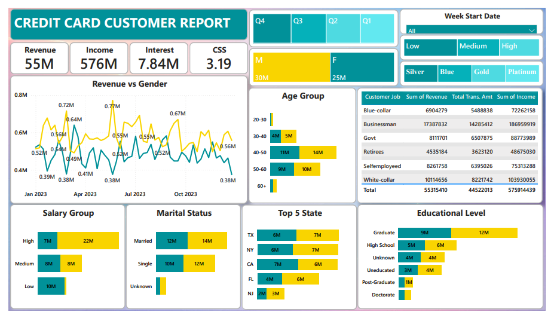

# 💳 Credit Card Transaction & Customer Analysis

## 📊 Project Overview

This project analyzes credit card transactions and customer demographics to identify spending patterns and revenue trends.

## 🎯 Business Problem

Financial institutions process large volumes of credit card transactions daily. Understanding customer behavior helps organizations improve financial strategies.

## 📂 Dataset

The dataset includes:

• Credit card transaction data  
• Customer demographic data  

## 🛠 Tools Used

• Power BI  
• SQL  
• Excel  
• DAX  

## 📈 Dashboard Preview

## 💡 Key Insights

• Some credit card categories generate higher revenue  
• Certain age groups perform more transactions  
• Spending patterns vary by region

## 📁 Project Structure

credit-card-transaction-customer-analysis

Dashboard/  
Dataset/  
SQL/  
Visuals/
